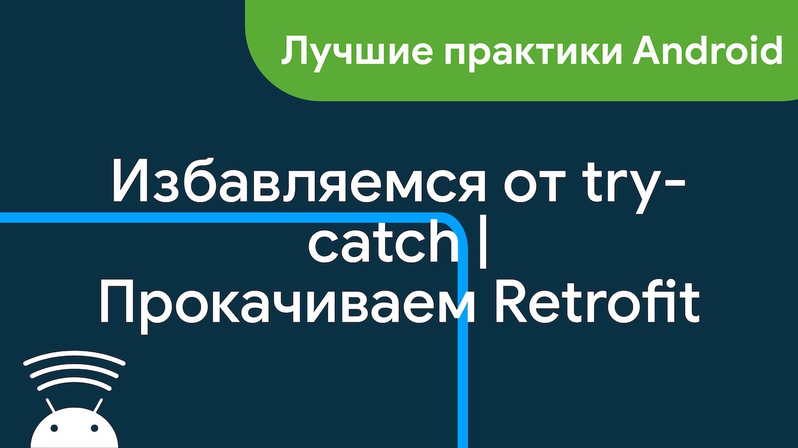

# AsyncResult

[📺 Смотреть видео на канале Android Broadcast 📺](https://youtu.be/zUP-ECi37s0)

Применяем мощь Kotlin, для того чтобы избавиться от try-catch при работе с [Retrofit](https://square.github.io/retrofit/), 
а также и в других асинхронных операциях.

📰 [Telegram канал с полезными материалами для Android разработчиков](https://ttttt.me/android_broadcast)

💰 Поддержать проект на [Boosty](https://boosty.to/androidbroadcast) или [Patreon](https://bit.ly/2TBOzlu)

📺 [YouTube канал Android Broadcast](https://www.youtube.com/c/androidBroadcast)

#### Используемые технологии
- Kotlin
- Kotlin Coroutines
- Kotlinx.Serialization
- Retrofit
